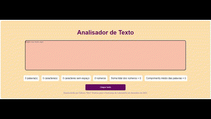

# Analisador de Texto

O objetivo deste projeto foi criar um analisador de texto capaz de contabilizar quantidades de palavras e números, caracteres com e sem espaço, comprimento médio das palavras e soma total dos números presentes no texto. O desenvolvimento do projeto ocorreu ao longo de 4 _Sprints_ de acordo com os critérios mínimos do projeto - situados ao final deste documento. O trabalho foi pautado na autoaprendizagem, buscando um contato maior com a linguagem JavaScript e com a criação e manipulação de eventos DOM.

## Etapas

As etapas seguidas para o desenvolvimento do projeto foram, respectivamente:

1) criação de conta no Github e download dos programas necessários para o desenvolvimento do projeto;
2) fork do repositório, criação de chave SSH do projeto e clonagem do repositório;
3) criação de protótipo de baixa fidelidade no <a href="https://www.figma.com/file/NLJHZleLgDKRHXNzFtQ9q7/Prot%C3%B3tipo-P1-Laborat%C3%B3ria?type=whiteboard&node-id=0-1&t=yquOWUvaO06hHkQf-0">Figma</a>;
4) criação de árvore HTML no protótipo supracitado, buscando visualizar a hierarquia do código;
5) desenvolvimento do código HTML;
6) estilização do projeto em CSS;
7) criação de eventos DOM no projeto;
8) desenvolvimento da lógica para análises de texto e números;
9) testes;
10) publicação no github.

## Índice

- [1. Considerações gerais](#1-considerações-gerais)
- [2. Preâmbulo](#2-preâmbulo)
- [3. Resumo do projeto](#3-resumo-do-projeto)
- [4. Funcionalidades](#4-funcionalidades)
- [5. Para Começar](#5-para-começar)
- [6. Boilerplate](#6-boilerplate)
- [7. Critérios de aceitação mínimos do projeto](#7-critérios-de-aceitação-mínimos-do-projeto)
- [8. Testes](#8-testes)
- [9. Objetivos de aprendizagem](#9-objetivos-de-aprendizagem)

---

## 1. Considerações gerais

- Este projeto foi desenvolvido de forma individual ao longo de 4 Sprints;
- O foco do projeto foi a criação de um analisador de texto com funcionalidades que aplicassem conceitos de HTML, CSS e Javascript;
- O principal objetivo foi compreender os usos do HTML semântico e diferentes formas de estilização com CSS, além de aprender sobre criação e manipulação de eventos DOM e Vanilla JavaScript. 

## 2. Preâmbulo

_Créditos: Foto de [ethan](https://unsplash.com/fr/@andallthings?utm_source=unsplash&utm_medium=referral&utm_content=creditCopyText)_
_em [Unsplash](https://unsplash.com/es/fotos/72NpWZJOskU?utm_source=unsplash&utm_medium=referral&utm_content=creditCopyText)_

Um analisador de texto é uma aplicação para extrair informações úteis de um
texto utilizando diversas técnicas, como o processamento de linguagem natural
(PLN),aprendizado de máquina (ML) e análise estatística. Essas aplicações podem
fornecer uma variedade de métricas que oferecem informações básicas sobre
o comprimento e a estrutura do texto, como contagem de palavras, contagem de
caracteres, contagem de sentenças e contagem de parágrafos. Outras métricas
incluem análise de sentimentos, que utiliza técnicas de PLN para determinar
o tom geral positivo, negativo ou neutro do texto, e análise de legibilidade,
que utiliza algoritmos para avaliar a complexidade e legibilidade do texto.

Em geral, as aplicações de análise de texto fornecem informações valiosas e métricas
sobre os textos que podem ajudar os usuários a tomar decisões informadas e tirar
conclusões significativas. Por meio do uso dessas ferramentas de análise, os usuários
podem obter uma compreensão mais profunda dos textos.

## 3. Resumo do projeto

Neste projeto, foi desenvolvida uma aplicação web a partir de usos do HTML, do CSS e do Javascript, permitindo a análise de um texto no navegador ao exibir uma série de indicadores e métricas específicas sobre caracteres, letras, números, etc.

## 4. Funcionalidades

O projeto possui as seguintes funcionalidades:

1. Permite a inserção de um texto escrevendo-o em uma caixa de texto.

2. Efetua o cálculo das seguintes métricas, atualizando os resultados em tempo real, conforme a usuária escreve o texto:

    - **Contagem de palavras**: a aplicação conta o número de palavras no texto de entrada e mostra essa contagem para a usuária.
    - **Contagem de caracteres**: a aplicação conta o número de caracteres no texto de entrada, incluindo espaços e sinais de pontuação, mostrando essa contagem para a usuária.
    - **Contagem de caracteres excluindo espaços e sinais de pontuação**:
    a aplicação conta o número de caracteres no texto de entrada, excluindo espaços e sinais de pontuação, e apresenta essa contagem para a usuária.
    - **Contagem de números**: a aplicação conta quantos números há no texto de entrada, apresentando a contagem para a usuária.
    - **Soma total dos números**: a aplicação soma todos os números que estão no texto de entrada e mostra o resultado para a usuária.
    - **Comprimento médio das palavras**: a aplicação calcula o comprimento médio das palavras no texto de entrada e mostra esse valor para a usuária.

3. A aplicação permite limpar o conteúdo da caixa de texto ao clicar em um botão.

## 5. Para começar

Antes de começar, foram feitas as seguintes instalações:

1. [Node.js](https://nodejs.org/pt-br/);
2. [Git](https://git-scm.com/download/);
3. O editor de código [Visual Studio Code](https://code.visualstudio.com/).

Depois, no [GitHub](https://github.com/):

1. Criação de um perfil;
2. ;_Fork_ do projeto;
3. Configuração da chave SSH no GitHub.

Depois, em um [shell]:

1. Clone o _fork_ para o PC;
2. Instalação das dependências do projeto com `npm install`;
4. Instalação do `playwright` com `npx playwright install chromium --with-deps`;
5. Inicialização do servidor web com `npm start`;
6. Início da codagem do projeto.

## 6. Boilerplate

A lógica do projeto foi implementada sem o uso de bibliotecas ou frameworks, mas apenas JavaScript puro, também conhecido como _Vanilla JavaScript_.

Para começar o projeto, foi realizado um _fork_ e um clone do um _boilerplate_ <a href="https://github.com/Laboratoria/SAP012-text-analyzer">disponível no repositório da Laboratória</a>. Um _boilerplate_ é a estrutura básica de um projeto e serve como um ponto de partida, contendo arquivos e a configuração inicial de dependências e testes.

O _boilerplate_ fornecido continha a seguinte estrutura:

    ./
    ├── .babelrc
    ├── .editorconfig
    ├── .eslintrc
    ├── .gitignore
    ├── README.md
    ├── package.json
    ├── src
    │   ├── analyzer.js
    │   ├── index.html
    │   ├── index.js
    │   └── style.css
    └── test
        ├── .eslintrc
        └── analyzer.spec.js

### Descrição de scripts / arquivos

- `README.md`: arquivo contendo informações sobre o projeto, desde sua origem à conclusão, explicando as etapas de desenvolvimento e funcionalidades disponíveis.
- `.github/workflows`: esta pasta contém a configuração para a execução do Github Actions. Seu conteúdo não foi modificado ao longo do projeto.
- `read-only/`: esta pasta contém os testes dos critérios mínimos de aceitação e end-to-end. Seu conteúdo não foi modificado ao longo do projeto.
- [`src/index.html`](./src/index.html): este arquivo contem a estrutura HTML do projeto, utilizando as noções de HTML semântico para sua construção.
  Este arquivo deve conter o seu HTML.
- [`src/style.css`](./src/style.css): este arquivo contem as estilizações realizadas ao longo do projeto, tendo como base o protótipo de baixa resolução. Não foram utilizados frameworks de CSS (Bootstrap, Materialize, etc), de modo que toda a estilização foi construída a partir de noções básicas de Design.
- [`src/analyzer.js`](./src/analyzer.js): este arquivo contem todo o código criado para a análise do texto inserido na página. O objeto presente no arquivo (`analyzer`) contem seis métodos:

  + `analyzer.getWordCount(text)`: para a construção da função, a lógica aplicada foi a declaração de uma variável do tipo `const` que consideraria como palavras tudo o que estivesse separado por espaços. A separação foi feita com o método `.split()`. Em seguida, foram filtrados os elementos do tipo `vazio ("")` nas `strings` por meio da função `.filter()`. Por fim, o `return` da função chama a variável e solicita, por meio da propriedade `.length` que seja apresentada a quantidade de `strings` separadas.
  + `analyzer.getCharacterCount(text)`: neste caso, o `return` da função foi construído solicitando a quantidade de caracteres por meio da propriedade `.length` aplicada ao parâmetro `text`.
  + `analyzer.getCharacterCountExcludingSpaces(text)`: nesta função, foi declarada uma variável do tipo `const` que solicitou a contagem de caracteres por meio da propriedade `.length`. Para a exclusão de caracteres especiais e espaços, o método `.replace()` foi acionado por meio de uma _expressão regular_ ou `regex`, construída de forma a considerar apenas letras e números em uma `string`. O `return` da função apresenta, então, o resultado das propriedades e métodos utilizados na construção da variável.
  + `analyzer.getNumberCount(text)`: para esta função foi declarada uma variável do tipo `const` cujo valor foi definido a partir do parâmetro `text` e da utilização dos seguintes métodos: 1) `.filter()` para determinar que `vazio ("")` não pode ser considerado um `NaN` e `NaN` é idêntico a `false`; 2) `.split()` para determinar que as `strings` separadas por espaços compõem um mesmo número; e 3) `.replace()` contendo uma `regex` determinando que números seguidos por ponto final sejam considerados. Em seguida, foi estabelecida uma condição `if...else` onde, caso o número `parseFloat` encontrado na variável declarada seja maior ou igual a 0, o `return` deve apresentar a quantidade de números presentes. Caso contrário, o `return` devolve 0.
  + `analyzer.getNumberSum(text)`: esta função utilizou como base a primeira variável declarada na função `getNumberCount`, que utiliza 3 métodos para retornar os números presentes no parâmetro `text`. Além disso, foi declarada uma variável `let total` com valor igual a 0. Em seguida, foi criado um `loop for` com os seguintes critérios: 1) foi declarada uma variável `let i` com valor igual 0; 2) caso "i" seja menor que a quantidade de caracteres encontrados na variável `const`; 3) "i" deve ter um incremento de +1. A variável `let total` seria, então, o resultado da soma dos números `parseFloat` encontrados na variável `const` mais o resultado de "i". O `return` do `loop for` devolve, desse modo, o valor da `let total`.
  + `analyzer.getAverageWordLength(text)`: para esta função, foram declaradas 3 variáveis do tipo `const`. Na primeira, foi aplicado o método `.split()` no parâmetro `text`. Na segunda variável, foi realizada a chamada da primeira variável e utilizado o método `.join()`, buscando unir todas as strings dentro do parâmetro `text`. Finalmente, na terceira variável, foi calculado o valor da quantidade de caracteres encontrados na segunda variável divididos pela quantidade de caracteres encontrados na primeira variável. Em seguida, foi criada uma condição `if...else`, onde, caso a terceira variável fosse maior ou igual a zero, o `return` devolveria um número `parseFloat`, podendo ser inteiro ou não, arredondado em até 2 casas decimais por meio do método `.toFixed`. Caso contrário, o `return` devolve 0.

  Para a aplicação prática do uso de cada função, veja o arquivo
  [`test/analyzer.spec.js`](./test/analyzer.spec.js).

  _Nota: para simplificar as funcionalidades, definiremos palavras como grupos
  de caracteres separados por espaços. Por exemplo, as palavras no texto de
  entrada `Sim, você consegue fazer!` são quatro:_

  + _`Sim,`_
  + _`você`_
  + _`consegue`_
  + _`fazer!`_

- [`src/index.js`](./src/index.js): este arquivo contem 2 eventos do DOM, utilizados para linkar a interação da usuária com as lógicas do `analyzer` e também fornecer a opção de limpar a página.
  + "`click`": evento criado com o objetivo de limpar a caixa de texto e as métricas por meio de um clique no botão criado. Para a construção deste evento, foi declarada uma variável do tipo `const areaTexto` para selecionar o elemento `<textarea>` a partir do método `.querySelector()` . Além disso, o elemento `<button>` foi selecionado por meio do método `.getElementById()` e, nele, adicionado o evento de clique por meio do método `.addEventListener()`. Em seguida, na função criada a partir do `addEventListener`, foi estabelecida a condição `if...else` em que, caso a `const areaTexto` tenha conteúdo diferente de 0, é acionado o método `location.reload()` que atualiza a página e zera o conteúdo da `<textarea>` e dos contadores. Caso contrário, ou seja, caso o conteúdo já seja 0, o `return` da função mantem a página zerada.
  + "`input`": evento criado com o objetivo de identificar a inserção de conteúdo na `<textarea>`. Para atrelar o conteúdo inserido às métricas construídas no objeto `analyzer`, foi realizada a importação do conteúdo do arquivo `src/analyzer.js`. Em seguida, foi necessário declarar 6 variáveis do tipo `const`, cada uma relativa a um contador específico, selecionado a partir do método `.querySelector()`. Na função criada pelo `addEventListener("input")`, cada variável teve o conteúdo do elemento `<li>`selecionado modificado por meio da propriedade `.textContent`. Esta manipulação dinâmica permite que as métricas sejam atualizadas, uma vez que, para cada variável, é atribuído o `.value` de cada função dentro do objeto `analyzer`, utilizando como base o elemento `<textarea>`, selecionado na variável `const areaTexto`. Desse modo, o resultado é atualizado em tempo real na IU (interface de usuária).
- [`test/analyzer.spec.js`](./test/analyzer.spec.js): este arquivo contém os
testes unitários para os métodos do objeto `analyzer`.

---

#### Deploy

Após a finalização do projeto, este foi publicado (ou _deployed_) no _Github Pages_ para que as usuárias da web pudessem acessá-lo.

## 7. Critérios de Aceitação Mínimos do Projeto

O projeto aqui apresentado passou em todos os critérios de aceitação mínimos apresentados a seguir. É importante destacar que os critérios de aceitação mínimos do projeto estão relacionados a cada objetivo de aprendizado.

### HTML

- **Uso de HTML semântico**

  + A aplicação possui um cabeçalho composto por um [`<header>`](https://developer.mozilla.org/pt-BR/docs/Web/HTML/Element/header) que é pai de um [`<h1>`](https://developer.mozilla.org/pt-BR/docs/Web/HTML/Element/Heading_Elements) com o texto `Analisador de texto`. Para que você possa praticar mais, esses
  elementos não podem ter atributos `id`, `name` ou `class`.

  + A aplicação utiliza um
        [`<textarea>`](https://developer.mozilla.org/pt-BR/docs/Web/HTML/Element/textarea)
        com o atributo `name` com o valor `user-input` para permitir à usuária
        inserir um texto. Para que você possa praticar mais, este elemento não pode
        ter atributos `id` ou `class`.

  + A aplicação utiliza uma
        [`<ul>`](https://developer.mozilla.org/pt-BR/docs/Web/HTML/Element/ul)
        com 6 filhos [`<li>`](https://developer.mozilla.org/pt-BR/docs/Web/HTML/Element/li),
        um para exibir cada métrica. Para que você possa praticar mais, esses
        elementos não podem ter atributos `id`, `name` ou filhos.

  + O [`<li>`](https://developer.mozilla.org/pt-BR/docs/Web/HTML/Element/li)
        para exibir a _contagem de palavras_ deve ter um atributo
        `data-testid` com o valor `word-count`.

  + O [`<li>`](https://developer.mozilla.org/pt-BR/docs/Web/HTML/Element/li)
        para exibir a _contagem de caracteres_ deve ter um atributo
        `data-testid` com o valor `character-count`.

  + O [`<li>`](https://developer.mozilla.org/pt-BR/docs/Web/HTML/Element/li)
        para exibir a _contagem de caracteres excluindo espaços e sinais de pontuação_
        deve ter um atributo `data-testid` com o valor `character-no-spaces-count`.

  + O [`<li>`](https://developer.mozilla.org/pt-BR/docs/Web/HTML/Element/li)
        para exibir a _contagem de números_ deve ter um atributo
        `data-testid` com o valor `number-count`.

  + O [`<li>`](https://developer.mozilla.org/pt-BR/docs/Web/HTML/Element/li)
        para exibir a _soma total de números_ deve ter um atributo
        `data-testid` com o valor `number-sum`.

  + O [`<li>`](https://developer.mozilla.org/pt-BR/docs/Web/HTML/Element/li)
        para exibir o _comprimento médio das palavras_ deve ter um atributo
        `data-testid` com o valor `word-length-average`.

  + A aplicação possui um rodapé composto por um
        [`<footer>`](https://developer.mozilla.org/pt-BR/docs/Web/HTML/Element/footer)
        que é pai de um
        [`
`](https://developer.mozilla.org/pt-BR/docs/Web/HTML/Element/p)
        que possui o nome da estudante desenvolvedora da aplicação como texto.
        Para que você possa praticar mais, esses elementos não podem
        ter atributos `id`, `name` ou `class`.

  + A aplicação utiliza um
        [`<button>`](https://developer.mozilla.org/pt-BR/docs/Web/HTML/Element/button)
        com o atributo `id` com o valor `reset-button` para permitir à usuária,
        através de um clique, limpar o conteúdo da caixa de texto.

### CSS

- **Uso de seletores CSS**

  + A aplicação utiliza
        [`seletores CSS de tipo`](https://developer.mozilla.org/pt-BR/docs/Learn/CSS/Building_blocks/Selectors/Type_Class_and_ID_Selectors#type_selectors)
        para estilizar o
        [`<header>`](https://developer.mozilla.org/pt-BR/docs/Web/HTML/Element/header)
        e o
        [`<footer>`](https://developer.mozilla.org/pt-BR/docs/Web/HTML/Element/footer).

  + A aplicação utiliza
        [`seletores CSS de classe`](https://developer.mozilla.org/pt-BR/docs/Learn/CSS/Building_blocks/Selectors/Type_Class_and_ID_Selectors#class_selectors)
        para estilizar os
        [`<li>`](https://developer.mozilla.org/pt-BR/docs/Web/HTML/Element/li)
        mencionados anteriormente.

  + A aplicação utiliza
        [`seletores de atributo`](https://developer.mozilla.org/pt-BR/docs/Learn/CSS/Building_blocks/Selectors/Attribute_selectors)
        para estilizar o
        [`<textarea>`](https://developer.mozilla.org/pt-BR/docs/Web/HTML/Element/textarea)
        utilizando o atributo `name`.

  + A aplicação utiliza
        [`seletores CSS de ID`](https://developer.mozilla.org/pt-BR/docs/Learn/CSS/Building_blocks/Selectors/Type_Class_and_ID_Selectors#id_selectors)
        para estilizar o
        [`<button>`](https://developer.mozilla.org/pt-BR/docs/Web/HTML/Element/button)
        com o atributo `id` com o valor `reset-button`.

- **Modelo de caixa (box model): borda, margem, preenchimento**

  + As
        [`classes CSS`](https://developer.mozilla.org/pt-BR/docs/Learn/CSS/Building_blocks/Selectors/Type_Class_and_ID_Selectors#class_selectors)
        dos
        [`<li>`](https://developer.mozilla.org/pt-BR/docs/Web/HTML/Element/li)
        filhos da
        [`<ul>`](https://developer.mozilla.org/pt-BR/docs/Web/HTML/Element/ul)
        definem um estilo usando as propriedades do
        [modelo de caixa](https://cssreference.io/box-model/),
        ([`background`](https://cssreference.io/backgrounds/),
        `border`,
        [`margin`](https://cssreference.io/property/margin/),
        [`padding`](https://cssreference.io/property/padding/)).

### Web APIs

- **Uso de seletores do DOM**

  + A aplicação utiliza o
        [`seletor do DOM querySelector`](https://developer.mozilla.org/pt-BR/docs/Web/API/Document/querySelector).

  + A aplicação utiliza o
        [`seletor do DOM getElementById`](https://developer.mozilla.org/pt-BR/docs/Web/API/Document/getElementById).

- **Manipulação de eventos do DOM (ouvintes, propagação, delegação)**

  + A aplicação registra um
        [Event Listener](https://developer.mozilla.org/pt-BR/docs/Web/API/EventTarget/addEventListener)
        para ouvir o evento `keyup` do `<textarea>` e atualizar as métricas
        quando o texto for digitado na caixa de texto.

  + A aplicação registra um
        [Event Listener](https://developer.mozilla.org/pt-BR/docs/Web/API/EventTarget/addEventListener)
        para ouvir o evento `click` do `<button>` que limpa o conteúdo da caixa
        de texto.

- **Manipulação dinâmica do DOM**

  + A aplicação atualiza o atributo
        [`textContent`](https://developer.mozilla.org/pt-BR/docs/Web/API/Node/textContent)
        ou
        [`innerHTML`](https://developer.mozilla.org/pt-BR/docs/Web/API/Element/innerHTML)
        dos `<li>` que exibem as métricas do texto.

### JavaScript

- **Tipos de dados primitivos**

  + A aplicação converte valores do tipo `string` para o tipo `number`.

- **Strings (cadeias de caracteres)**

  + A aplicação utiliza métodos para manipular strings como
        [`split`](https://developer.mozilla.org/pt-BR/docs/Web/JavaScript/Reference/Global_Objects/String/split),
        [`trim`](https://developer.mozilla.org/pt-BR/docs/Web/JavaScript/Reference/Global_Objects/String/trim)
        ou
        [`replace`](https://developer.mozilla.org/pt-BR/docs/Web/JavaScript/Reference/Global_Objects/String/replace).

- **Variáveis (declaração, atribuição, escopo)**

  + A aplicação declara variáveis com
        [`let`](https://developer.mozilla.org/pt-BR/docs/Web/JavaScript/Reference/Statements/let)
        e
        [`const`](https://developer.mozilla.org/pt-BR/docs/Web/JavaScript/Reference/Statements/const).

  + A aplicação NÃO declara variáveis com `var`.

- **Uso de condicionais (if-else, switch, operador ternário, lógica booleana)**

  + A aplicação utiliza a estrutura
        [`if..else`](https://developer.mozilla.org/pt-BR/docs/Web/JavaScript/Reference/Statements/if...else)
        para avaliar condições.

- **Uso de loops (while, for, for..of)**

  + A aplicação utiliza a estrutura
        [`for`](https://developer.mozilla.org/pt-BR/docs/Web/JavaScript/Reference/Statements/for)
        para criar um loop.

- **Funções (parâmetros, argumentos, retorno)**

  + O objeto `analyzer` contém um método `getWordCount` para calcular a
        contagem de palavras de um texto.

  + O objeto `analyzer` contém um método `getCharacterCount` para calcular a
        contagem de caracteres de um texto.

  + O objeto `analyzer` contém um método `getCharacterCountExcludingSpaces`
        para calcular a contagem de caracteres excluindo espaços e pontuações
        de um texto.

  + O objeto `analyzer` contém um método `getNumbersCount` para contar quantos
        números existem em um texto.

  + O objeto `analyzer` contém um método `getNumbersSum` para calcular a soma
        dos números em um texto.

  + O objeto `analyzer` contém um método `getAverageWordLength` para calcular
        o comprimento médio das palavras em um texto.

- **Testes unitários (unit tests)**

  + Todos os testes unitários passam.

- **Módulos do ECMAScript (ES Modules)**

  + A aplicação utiliza
        [`import`](https://developer.mozilla.org/pt-BR/docs/Web/JavaScript/Reference/Statements/import)
        e
        [`export`](https://developer.mozilla.org/pt-BR/docs/Web/JavaScript/Reference/Statements/export)
        para importar e exportar valores de um módulo JavaScript.

- **Uso de linter (ESLINT)**

  + Ao executar o linter, não são exibidos erros de formato e estilo.

- **Uso de identificadores descritivos (Nomenclatura e Semântica)**

  + O código utiliza identificadores descritivos para variáveis e funções.

### Controle de Versões (Git e GitHub)

- **GitHub: Criação de conta e repositórios, configuração de chaves SSH**

  + A estudante criou uma conta no Github.

  + A estudante configurou sua conta do Github com uma chave SSH.

- **Git: Controle de versões com git (clone, add, commit, push)**

  + A estudante criou um _fork_ para o projeto.

  + A estudante clonou seu repositório usando uma chave SSH.

  + A estudante criou _commits_ e os salvou no Github.

- **GitHub: Implantação com GitHub Pages**

  + A aplicação está implantada no GitHub Pages.

### Foco na Usuária

- **Projetar e desenvolver um produto ou serviço centrado nas usuárias**

### Design do Produto

- **Projetar em diferentes níveis de fidelidade**

  + A estudante criou protótipos de baixa fidelidade para a UI (interface gráfica).

- **Seguir os princípios básicos do design visual**

  + Foram consideradas as regras básicas de
        [design visual](https://coda.io/d/Bootcamp-UX-Contenido_dqkqk2rV9Z2/Reglas-basicas-de-diseno-visual_suVcO)
        para projetar a UI (interface gráfica).

## 8. Testes

Este projeto conta com 3 conjuntos de testes que ajudaram a verificar se
os critérios mínimos de aceitação foram cumpridos.

### Testes Unitários

Um teste unitário é uma técnica de teste de software na qual se verifica
que cada componente individual de um programa ou sistema funcione corretamente
isoladamente. Em outras palavras, cada unidade de código é testada separadamente
para garantir que atenda aos requisitos e especificações.

Os testes unitários deste projeto executaram os métodos `getWordCount`,
`getCharacterCount`, `getCharacterCountExcludingSpaces`, `getNumbersCount`,
`getNumbersSum` e `getAverageWordLength` com diferentes argumentos e verificarão
se os valores retornados são os esperados.

Os testes foram executados com o comando `npm run test` como mostrado
na imagem a seguir:

O _boilerplate_ inclui tarefas que executam [eslint](https://eslint.org/) e
[htmlhint](https://github.com/yaniswang/HTMLHint) para verificar o `HTML` e
`JavaScript` em relação a diretrizes de estilo. Ambas as tarefas são executadas
automaticamente antes de executar os testes unitários ao usar o comando
`npm run test`. No caso do `JavaScript`, estamos usando um arquivo de configuração
do `eslint` chamado `.eslintrc`, que contém informações mínimas sobre o parser
a ser usado (qual versão do JavaScript/ECMAScript), o ambiente (navegador neste caso)
e as [regras recomendadas (`eslint:recommended`)](https://eslint.org/docs/rules/).
Em relação às próprias regras/diretrizes de estilo,
vamos seguir as recomendações _padrão_ tanto do `eslint` quanto do `htmlhint`.

### Testes de Critérios Mínimos de Aceitação

Esses testes analisaram os arquivos
[`index.html`](src/index.html),
[`index.js`](src/index.html),
[`analyzer.js`](src/analyzer.js)
e
[`style.css`](src/style.css)
para verificar se o projeto cumpriu os
[critérios mínimos de aceitação](#6-critérios-de-aceitação-mínimos-do-projeto).
Cada critério está relacionado a um objetivo de aprendizado.

Os testes foram executados com o comando `npm run test:oas`
como mostrado na imagem a seguir:

Também foram executados os testes de cada grupo de objetivos de aprendizado
individualmente com os seguintes comandos:

- `npm run test:oas-html`
- `npm run test:oas-css`
- `npm run test:oas-web-api`
- `npm run test:oas-js`

#### Testes End-to-End

Um teste end-to-end (E2E) é uma técnica de teste de software na qual se verifica
o funcionamento de todo o sistema, do início ao fim. Em outras palavras, é testado
o fluxo completo do software, simulando a interação da usuária com a aplicação,
para garantir que todas as partes do sistema funcionem corretamente em conjunto.

Os testes foram executados com o comando `npm run test:e2e` como mostrado
na imagem a seguir:

### GitHub Actions

Este repositório usa o GitHub Actions para executar automaticamente
os testes unitários, testes de critérios mínimos de aceitação e
testes end-to-end toda vez que você fizer um _push_ no ramo
_main_ do seu repositório.

Você pode verificar o resultado desta GitHub Action
na aba _Actions_ do seu repositório no GitHub,
como mostrado na seguinte imagem:

## 9. Objetivos de aprendizagem

Os objetivos de aprendizagem definidos para este projeto foram atrelados à estratégia de trabalho desenvolvida ao longo das _Sprints_. Desse modo, a desenvolvedora utilizou menos tempo na codagem em HTML e CSS, aprofundando no aprendizado da linguagem JavaScript e nas manipulações do DOM, conforme os tópicos apresentados abaixo:

#### Web APIs

- **Uso de seletores de DOM**

- **Manipulação de eventos de DOM (listeners, propagação, delegação)**

- **Manipulação dinâmica de DOM**

#### JavaScript

- **Tipos de dados primitivos**

  - **Strings (cadeias de caracteres)**
- **Variáveis (declaração, atribuição, escopo)**
- **Uso de condicionais (if-else, switch, operador ternário, lógica booleana)**
- **Uso de laços (while, for, for..of)**
- **Funções (params, args, return)**
- **Testes unitários (unit tests)**
- **Módulos de ECMAScript (ES modules)**
- **Uso de linter (ESLINT)**
- **Uso de identificadores descritivos (Nomenclatura e Semântica)**

#### Controle de Versões (Git e GitHub)

- **Git: Instalação e configuração**

- **Git: Controle de versão com git (init, clone, add, commit, status, push, pull, remote)**

- **GitHub: Criação de contas e repositórios, configuração de chave SSH**

- **GitHub: Implantação com GitHub Pages**

#### Centrado no usuário

- **Desenhar e desenvolver um produto ou serviço colocando as usuárias no centro**

#### Design de produto

- **Design em diferentes níveis de fidelidade**

- **Aplicar os princípios de desenho visual (contraste, alinhamento, hierarquia)**
